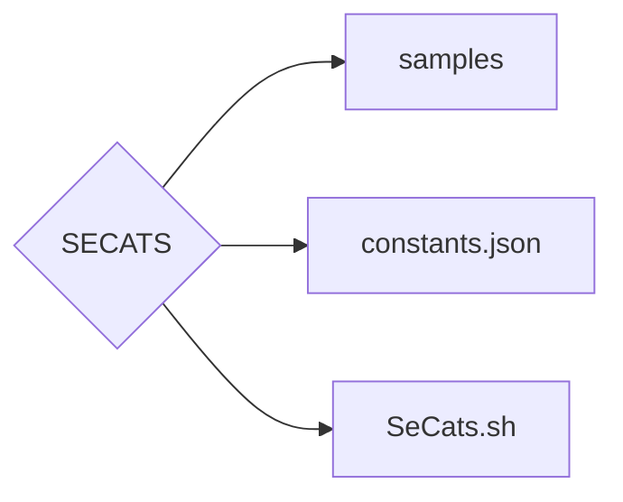

# SECATS - Threat Sample Testing Tool

> **Disclaimer**：The use of this tool is limited to legal purposes only. All actions related to the use of this tool must comply with the laws and regulations of the country or region where it is being used. Any illegal or malicious use is not related to the developers, and users should bear legal responsibility on their own.

---

## Table of Contents

1. [Tool Features and Highlights](#Tool-Features-and-Highlights)
2. [Application Scenarios](#Application-Scenarios)
3. [Module Explanation](#Module-Explanation)
   - [Token Bucket Algorithm and Rate Limiter](#Token-Bucket-Algorithm-and-Rate-Limiter)
   - [Proxy Pool Manager](#Proxy-Pool-Manager)
   - [HTTP Session Management](#HTTP-Session-Management)
   - [Threat Sample Generation and Parsing](#Threat-Sample-Generation-and-Parsing)
   - [Network Request Sending and Proxy Usage](#Network-Request-Sending-and-Proxy-Usage)
4. [Main Program Flow](#Main-Program-Flow)
5. [Usage Flow](#Usage-Flow)
---

## Tool Features

```auto
root@xxxxxxxxxxx:~# python3 SeCats.py

███████╗███████╗ ██████╗  █████╗ ████████╗███████╗
██╔════╝██╔════╝██╔════╝ ██╔══██╗╚══██╔══╝██╔════╝
███████╗█████╗  ██║  ███╗███████║   ██║   ███████╗ 
╚════██║██╔══╝  ██║   ██║██╔══██║   ██║   ╚════██║
███████║███████╗╚██████╔╝██║  ██║   ██║   ███████╗
╚══════╝╚══════╝ ╚═════╝ ╚═╝  ╚═╝   ╚═╝   ╚══════╝ By atangccc-Setoi

2024-11-15 07:53:12,829 INFO     2024-11-15 07:53:12 Configuration file check result:
2024-11-15 07:53:12,829 INFO     2024-11-15 07:53:12 Path validation: Passed
2024-11-15 07:53:12,829 INFO     2024-11-15 07:53:12 Format validation: Passed
2024-11-15 07:53:12,829 INFO     2024-11-15 07:53:12 Required keys validation: Passed (Missing keys: None)
SECATS-Security Testing Evaluation Tool🚀
Enter the number of threat samples to generate: 100
Generating threat samples 🚀 ━━━━━━━━━━━━━━━━━━━━━━━━━━━━━━━━━━━━━━━━ 100% 0:00:00
Generated 100 threat samples
Save the threat samples to a Parquet file? (y-yes/n-no): y
Saved chunked data to file: 2024-11-15/web_attack_samples_part1.parquet, row range 0 to 100
Enter the target website address (domain or IP address): www.xxx.com
The target domain or IP address https://www.xxx.com is valid
Use proxy pool? (y-yes/n-no): y
Validating proxies in the proxy pool 🚀 ━━━━━━━━━━━━━━━━━━━━━━━━━━━━━━━━━━━━━━━━ 100% 0:00:00
Number of valid proxies: 40
Select thread type 🚀:
1. Recommended 🚀-50
2. Fast 🚀-100
3. Ultra Fast 🚀-200
4. Custom 🚀
Enter thread option (1-4): 1
Enter requests per second (1-1000): 10
Executing task 🚀 ━━━━━━━━━━━━━━━━━━━━━━━━━━━━━━━━━━━━━━━━ 100% 100/100 48.656412284006365
Execution completed 🚀! Success: 85, Failures: 15
```

This tool has the following features that make it more efficient, secure, and automated for network request testing and rate limiting control:

- **Token Bucket Algorithm**：Implements request flow control based on the classic Token Bucket Algorithm, supporting stable rate limiting in high concurrency environments.
- **Proxy Pool Management**：Manages multiple proxy pools, conducts health checks, and maintains scoring to ensure high availability of proxies in the pool.
- **HTTP Session Reuse**：Uses requests.Session() to reuse connections, reduce connection overhead, and improve the performance of concurrent requests.
- **Threat Request Sample Generation**：Automatically generates HTTP request samples of various methods for stress testing or network security compliance testing.
- **Multi-threading and Rate Limiting**：Provides flexible multi-threading and request rate limit settings, suitable for various request volume needs.
- **Configurable User Input Interface**：Allows users to set the number of threat requests, target website address, whether to use a proxy pool, etc., for easy use.
- **Operation Logs and Result Recording**：Automatically records successful and failed requests during testing for subsequent data analysis.

---

## Application Scenarios

This tool is applicable for the following scenarios:

1.Firewall Performance Testing
2.Security Threat Sample Generation
3.Stress and Load Testing
4.Automated Security Testing

## Module Explanation

### Token Bucket Algorithm and Rate Limiter

This traffic control module is implemented through TokenBucket and RateLimiter classes for precise request rate control.

#### TokenBucket

The TokenBucket class implements the basic Token Bucket Algorithm. By setting the capacity and refill rate, it controls request flow, automatically filling a fixed number of tokens per second to ensure that the request rate complies with preset standards.

Main attributes and methods:

- **`__init__`**：Initializes the capacity and refill rate of the token bucket to adapt to different network request needs.
- **`refill`**：Refill tokens at the preset rate to ensure effective replenishment under high concurrency.
- **`take`**：Attempts to take tokens from the bucket. If successful, the request is allowed; otherwise, the request is limited.

#### RateLimiter

The`RateLimiter`class provides a simple rate control method, serving as a replacement for the `TokenBucket` in low-load scenarios to meet basic rate limiting needs.

---

### Proxy Pool Manager

The`ProxyPoolManager`is responsible for managing, updating, and monitoring the availability and scoring of proxies in the pool. It ensures automatic selection of high-quality proxies by adjusting proxy ratings based on success and failure rates.

Main functions:

- **`__init__`**： Initializes the proxy pool and proxy scoring system, loading preset proxies.
- **`update_proxy_score`**：Dynamically adjusts proxy scores based on success and failure rates, removing low-rated proxies.
- **`get_best_proxy`**：Selects the highest-quality proxy based on its rating.
- **`remove_proxy`**：Automatically removes proxies with ratings below the set threshold to maintain pool quality and stability.

#### Proxy Health Check

通过 `check_proxy_health` 函数验证代理池中的代理可用性，确保请求的成功率，筛选和记录有效代理。

---

### HTTP 会话管理

The `get_shared_session`function manages HTTP sessions, reusing TCP connections with requests.Session() to reduce overhead and improve request performance.

- **Session Pool Reuse**： Avoids frequent connection establishment, reducing resource waste, especially beneficial in high concurrency scenarios.
- **Connection Retry Policy**：Implements automatic retries through session settings to increase success rates and reliability.

---

### Threat Sample Generation and Parsing

The **`generate_web_attack_samples`** and **`parse_sample`** functions simulate the generation of various types of HTTP request samples, supporting methods such as GET, POST, and PUT, useful for network threat testing and simulated attack traffic.

- **Threat Request Generation**： Generates requests based on the number of samples specified by the user.
- **Sample Parsing**：Parses generated request samples and extracts key elements of the HTTP request (method, path, headers, content).

> Note: The generated threat request samples are intended for legal and compliant testing only. Please refrain from using them for illegal purposes.

---

### Network Request Sending and Proxy Usage

**`send_request_with_proxy`**：This method is responsible for sending HTTP requests with proxy support, featuring retry mechanisms, timeout controls, and rate limiting functions.

- **Rate Limiting**：The Token Bucket controls the request frequency to ensure it aligns with the preset request rate.
- **Proxy Rotation**：Dynamically selects the best proxy from the pool to reduce the risk of being blocked.
- **Retry and Timeout Settings**：If a request fails or times out, it will be retried to ensure stable request sending.

---

## Main Program Flow

The main program provides an interactive interface and executes threat testing requests based on user configuration. The process is as follows:

1. **Enter Threat Sample Quantity**：Generate the specified number of threat test requests.
2. **Verify Target URL**：Check if the target URL is valid.
3. **Choose Proxy Pool Usage**： If the proxy pool is enabled, conduct a health check to select valid proxies.
4. **Set Thread Count and Request Rate**：Configure the thread pool and token bucket as per user input.
5. **Execute Requests**：Executes requests based on a multi-threaded pool at a preset rate. Successful or failed requests are logged in separate queues for later analysis.
> **Interrupt Protection**：Captures "Ctrl+C" interruption signal to safely close all threads and clear queues, preventing unprocessed requests from being overlooked.
---

## Usage-Flow
Directory structure:

### Download Image

```
docker pull cnhyk123/secats:latest
```
### Add Proxy
- Details can be found in the constants.json file
### Run Program
```
chmod -x ./SeCats.sh
```
```
./SeCats.sh
```
